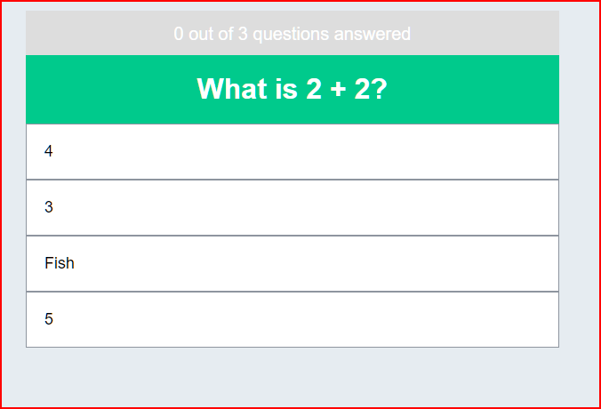
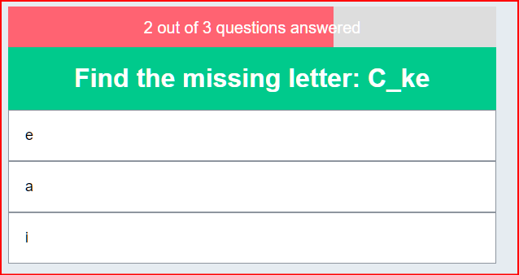
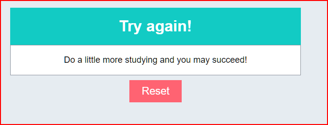

# Vue quiz App

This is a simple Quize app built with [Vue.js](https://vuejs.org/) and [vite](https://vitejs.dev/)

## Operations

<ul>
    <li>List Questions</li>    
    <li>List Answers for Respective Questions</li>
    <li>Give Feedback for the Answers given at the end.</li>
    <li>Reset Button to Start Over.</li>
</ul>

**NB: The app utilizes use of Arrays for Questions and Answers.**
## Landing page Screen


## Progress Screen


## Results And Reset Button Screen



## Recommended IDE Setup

[VSCode](https://code.visualstudio.com/) + [Volar](https://marketplace.visualstudio.com/items?itemName=Vue.volar) (and
disable
Vetur) + [TypeScript Vue Plugin (Volar)](https://marketplace.visualstudio.com/items?itemName=Vue.vscode-typescript-vue-plugin).

## Customize configuration

See [Vite Configuration Reference](https://vitejs.dev/config/).

## Project Setup

### Clone the project

```sh
git clone https://github.com/Emmanuelamanga/vue-quiz-app.git
```

### Navigate to the app directory

```sh 
cd vue-quiz-app
```

### Install the required packages

```sh
npm install
```

### Compile and Hot-Reload for Development

```sh
npm run dev
```

### Compile and Minify for Production

```sh
npm run build
```
